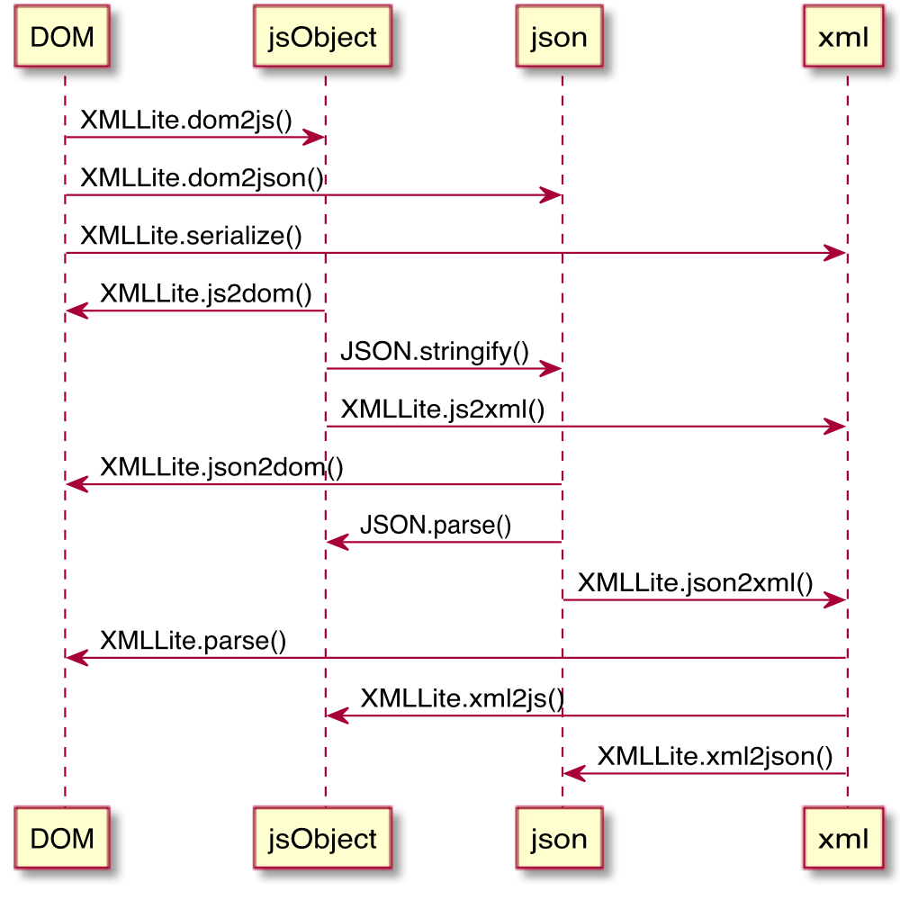

xml-lite
========

**maintaining xml** in pure javascript (IN BOTH NODE.JS &amp; BROWSERS)

## maintaining?

### converting



### editing/traversing

```javascript
XMLLite.findChildNode();
XMLLite.findChildNodes();
XMLLite.findOrCreateChildNode();
XMLLite.removeChildNode();
XMLLite.eachChildNode();
// ...
```

Actually, you can get the js object from `XMLLite.xml2js(xml)`, do what ever you want, and convert it back to xml again with `XMLLite.js2xml(obj)`.

## why?

1. A reasonable need for usage in both Node.js and Browsers
2. A more reasonable need to use native APIs(DOMParser/XMLSerializer) to speed up the maintaining process and keep the library thin

## why `xml-lite`?

1. It **works exactly the same in both Node.js and Browsers**
2. The browser version is supper **light-weight**([dist/xml-lite.js](./dist/xml-lite.js))
3. **Convenient** APIs for converting between xml/js/json/DOM, and lots of helpers to maintain the data structures
4. Super **fast**. it takes less than 30ms to convert an xml document with over 1,000 nodes into a js object

## install

```shell
$ npm install xml-lite --save
```

in browsers:

```html
<script src="$path/to/xml-lite/dist/xml-lite.js"> <!-- window.XMLLite is available -->
```

## [API](./doc/api.md)

## [json spec](./doc/json-spec.md)

## [roadmap](./doc/roadmap.md)
